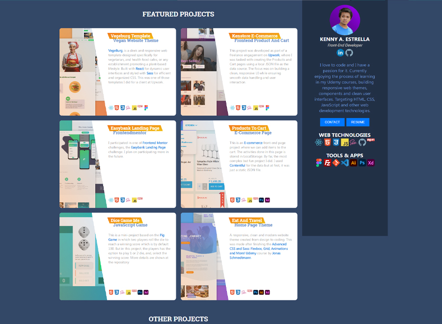

## Personal Website

This is a home page that'll serve as my **Personal Website** this year as I go out there and apply for jobs related to **Front-end Development**. Purely designed and coded from scratch. Learned many things from this project especially in realizing that we can use **window.innerWidth** in **resize event** to make the layout responsive.

### Packages Used

1. sass
2. live-server
3. autoprefixer
4. postcss
5. postcss-cli
6. npm-run-all
7. uglifycss

### Project Screenshot

[Live Demo](https://kennyestrellaworks-personal-website.netlify.app/)

[Source Code](https://kennyestrellaworks-personal-website.netlify.app/)

### Used technologies

    

### Used tools

### Oct 3 2023

Updating resume.

### Oct 18 2022

Added Profile section height media query.
